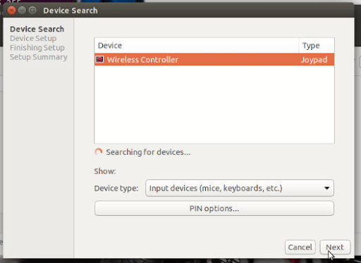
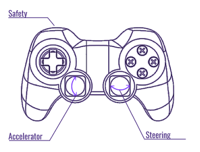

# [](#header-1)Robot Software Setup
This tutorial will get your car up and running teleoperation.

## Software Overview


{: .note }
The following are required before continuing with installing the necessary libraries.
- SD card flashed with the latest [NVIDIA Jetpack]{https://developer.nvidia.com/embedded/jetpack} image.
- Internet (either WiFi or ethernet)
- Monitor, HDMI cable, mouse, keyboard

## Booting Up
1. Power on and boot the Jetson. The green light on the right side should turn on.
2. Plug a monitor, keyboard, and mouse into the car.
3. Follow the on-screen prompts to complete setup of the Jetson Nano operating system. we suggest using the following values:
```
Username: robot
Name: robot
Computer Name: goose
```

## Setup Wi-Fi
You need to set the car up with a static IP if you want to install additional software on the car, or be able to use the internet on your laptop while connected to the car. But most computers do not have a static IP.

#TODO

## Connect the bluetooth controller
Connect to PS4 controller, for the first time: [Build Instructions - MuSHR: The UW Open Racecar Project](https://mushr.io/hardware/build_instructions/#:~:text=Note%20the%20column,dialog.%20(Fig.%2015.7)) 

{: .note }
if there already are “wireless controller”, remove them first, because all the controllers use the same name.



## Setup Docker & Install MuSHR stack
Robot setup is similar to the simulation setup. Follow the following from the [MuSHR simulation setup](https://anr-multitrans.github.io/Robot_MuSHR/docs/noetic/quickstart_with_foxglove/).

## Launching Teleoperation
First, all ROS commands must be run inside a docker container. If you need to create multiple terminal sessions we recommend entering one docker container then using tmux (pre-installed). That way you only need to remember to run mushr_noetic once.

Or if you are using Visual Studio Code, it is even better, because you can check and modifiy the files in it, and create as much terminals as you want. For the first time, you can connet to the car, start the MuSHR_noetic, and then connet to the continar running on the car. After that, Visual Studio Code will remenber it that next time you can start the continar directly with it.

Turn on the car and vesc by plugging their batteries in. Enter the docker container.
```$ mushr_noetic```
or
```$ docker exec -it [CONTAINER_ID] bash```
if you don't want to start a new container.

Then in the same terminal (within the Docker container), run teleop.
```$ roslaunch mushr_base teleop.launch```

You should see the lidar spinning and be able to steer with the controller. (Activate all sensors by default.)

## Teleoperation (manual driving)


#TODO

## Visualization
After starting up, the robot terminal should print out a line similar to ```Rosbridge WebSocket server started at ws://0.0.0.0:9090```.

Unlike simulation, visualization usually is run on a separate computer (though you can install Foxglove on the robot). From the [Foxglov](https://anr-multitrans.github.io/Robot_MuSHR/docs/noetic/Foxglove/) tutorial complete the following steps on your separate visualization computer.

Fill out the WebSocket URL with the robot’s IP and port that the simulator output before.

