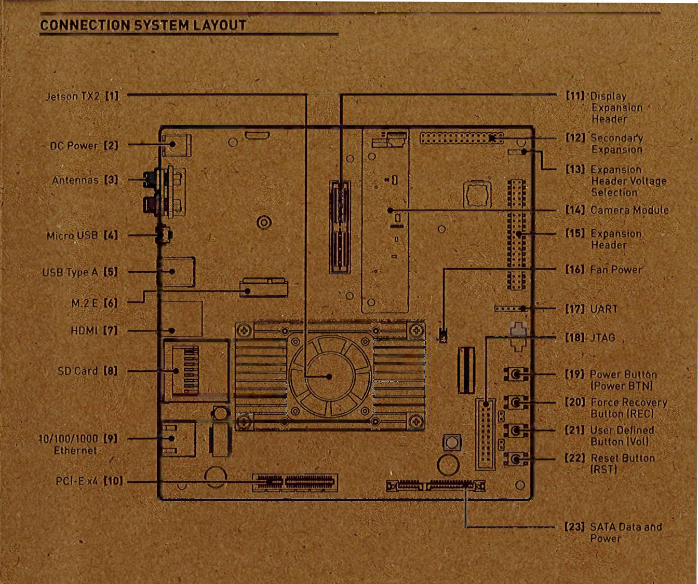
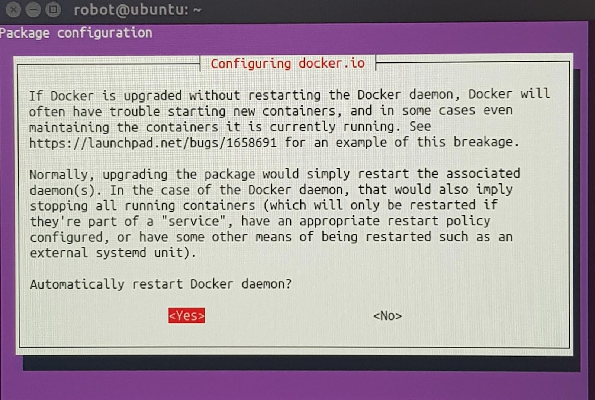

# [](#header-1)Jetson Driver Installation
## Jetson TX2

### 1. Flash TX2 with your laptop
First, download the user guidebook from [TX2 user guide][def3], and go to the "**how to install jetpack**" part and follow the instructions. You are required to perform 4 steps, here are some highlights and additions:

**Step 1**: Download and install NVIDIA SDK Manager on the Linux host computer.
1. Supported host operating systems are **Ubuntu Linux x64 Version 18.04 or 16.04**.
2. You will be asked to make an account before downloading NVIDIA SDK Manage.

**Step 2**: Connect your developer kit to the Linux host computer.

For flashing, you don’t have to connect the display, keyboard, and mouse, only USB Micro AB to connect the TX2, computer, and AC adapter.

**Step 3**: Put your developer kit into Force Recovery Mode. 

[19] - Power Button

[20] - Force Recovery Button


**Step 4**: Use SDK Manager to select and install desired components.
1. Go to [SDK Manager documentation](https://docs.nvidia.com/sdk-manager/index.html) and choose to [Install Jetson Software with SDK Manager](https://docs.nvidia.com/sdk-manager/install-with-sdkm-jetson/index.html).
2. Normally, we set the username and password below: 
    - Username: **robot** (if you have more than one race robot, name it with _[number])
    - Password: **prl_robot**
3. Internet connection error: try another internet (best with a static IP address).

### 2. Connect TX2
Once done, connect TX2 with the screen, the mouse, and the keyboard. Now, you can operate directly on TX2. You can perform the following operations:
1. Connect to the wifi
2. (Optional)Update Ubuntu software: 
```
$ sudo apt-get update
$ sudo apt-get upgrade
```
A window will pop up and there will be a question about configuring docker.io: “Automatically restart Docker daemon”? -> The answer is YES 


### 3. Boot and reboot
- Boot: press the power button
- Shut down:
    - Click the power off when you have a screen, keyboard, and mouse connected to the TX2.
    - In the terminal (also works on other PC connected to TX2 remotely):  
    ```$ sudo shutdown -P now```
    - Force shutdown or in case of a crash, press the car’s power button for 10s.

## Jetson Nano

[def]: ../../assets/images/tx2_flashing_docker.jpg
[def2]: https://docs.nvidia.com/sdk-manager/install-with-sdkm-jetson/index.html
[def3]: https://developer.nvidia.com/embedded/downloads#?search=developer%20kit%20user%20guide&tx=$product,jetson_tx2

