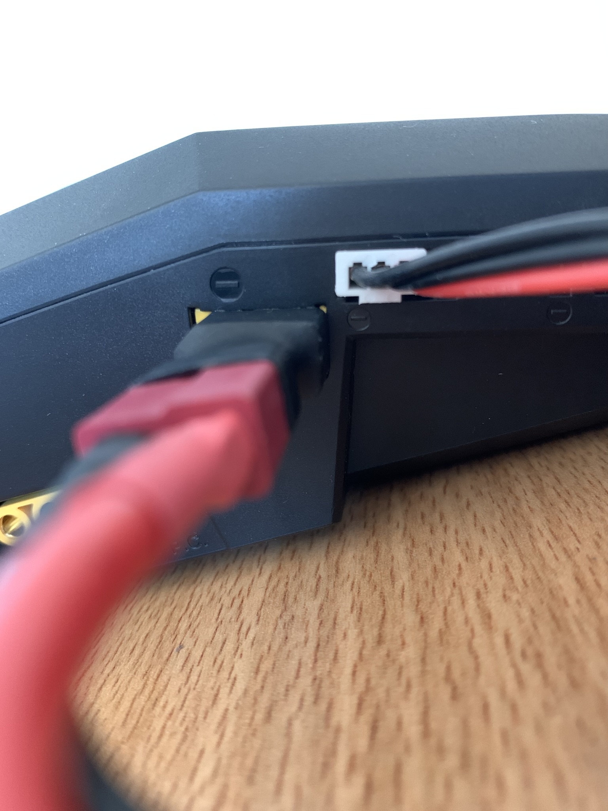
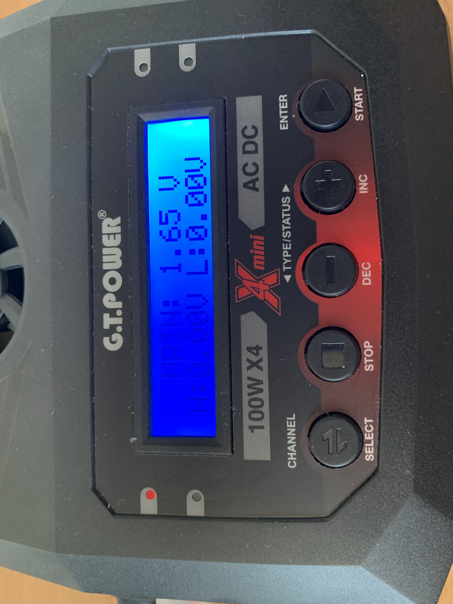
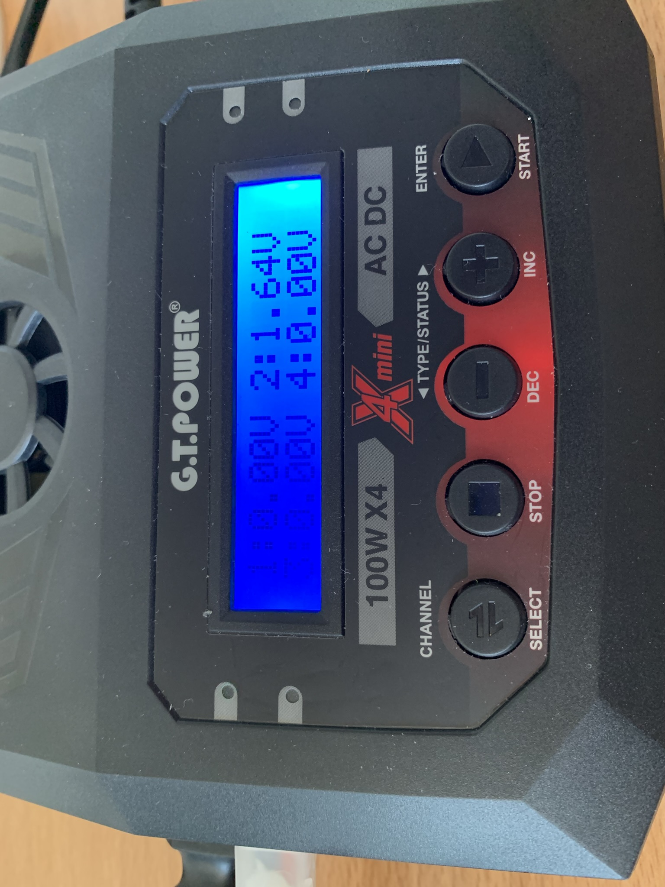
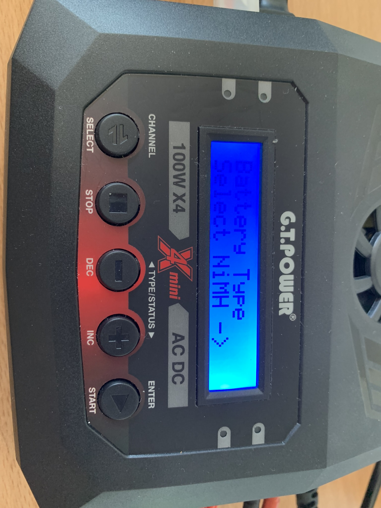
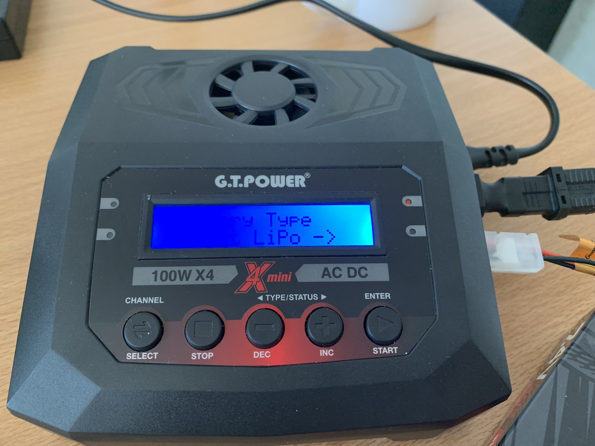
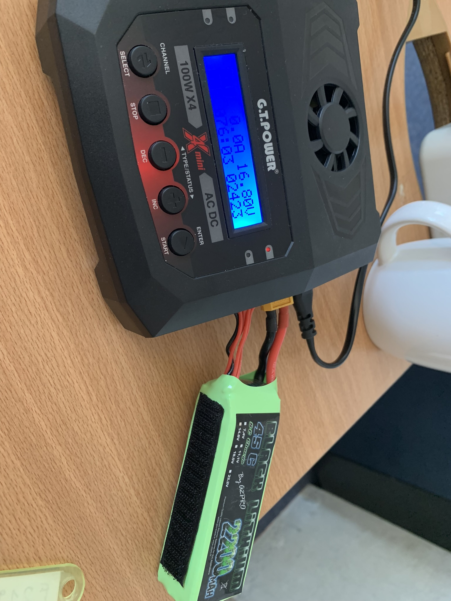

# Hardware Problem Solving
## How Do I rescue over-drained LiPo batteries?

The usable voltage range for a standard lipo battery cell is 3.2v to 4.2v. Any lower than 3.2v and the battery may be permanently damaged. Any higher than 4.2v and you significantly increase the risk of a battery bursting into flames.

### Check battery voltage
1. Connect the main and the sub plugs of your LiPo battery to your charger. Note the positive(+, red) and negative(-, black) sides of the sub-plug.

2. Select **User Program - Cell Meter**, press **ENTER**.
3. Now the voltage information will showed on the screen. The total voltage for all cells, the highest and the lowest cell voltage.

4. Press **ENTER** once more, the voltage for each cell will show on the scree. 

When the battery voltage is too low to charge, you should replace the battery as it is no-longer going to function properly. But you might also be-able to rescue that battery and use it for a bit longer.

{: .warning }
If you attempt to rescue a battery using these instructions you do so at your own risk. If you are not comfortable with the possibility that your battery may catch fire, you may just want to discard the battery.

### Rescue over-drained LiPo batteries
[REF](https://www.amaflightschool.org/getstarted/how-do-i-rescue-over-drained-lipo-batteries)

1. Connect the main plug of your LiPo battery to your charger and chose the **User Program - Select NiMH**. Start charge at the lowest current(0.1A) possible. Select a voltage the matches your LiPo battery’s nominal voltage.

2. After a minute or two your battery should recover to about 3.3 volts per cell. To check this simply read the total voltage of your battery and divide that by the number of cells.

3. When the total voltage is equal to about 3.3 volts per cell you can stop the NiMH charging and switch to LiPo charging.

4. Connect bothe the main and the sub plug of your LiPo battery to your charger. Select **User Program - Select LiPo**. Then select LiPo balance charge at 0.5C (A = mAh * C / 1000) rating and a voltage the matches your LiPo battery’s nominal voltage. This will take longer than charging at 1C but is safer.

5. Once the balance charge has completed balancing you should have a fully recovered LiPo battery.

{: .warning }
If you are unable to restore the voltage by this method, your battery may be permanently damaged and it is recommended not to use it again.

