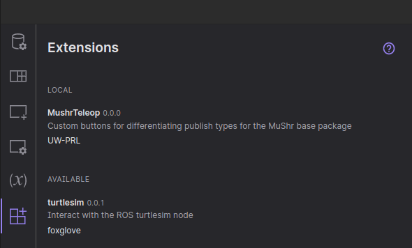

# Foxglove


{: .note }
This tutorial is for MacOS or Linux users only.

## Foxglove Studio
We can use Foxglove Studio to visualize our robot and map.

### Downloading Foxglove Studio
{: .note }
Make sure [foxglove](https://foxglove.dev/download) is the latest version.

### Import layout
Open Foxglove Studio, and click the “Layouts” button on the left panel (second from top) and then click Import layout button pictured below.
.png)

Import the preset layout from: ```mushr/mushr_utils/foxglove/foxglove_layout.json```.

### MuSHR panel extension
Navigate to the Extensions tab (bottom icon on the left panel) and install the MushrTeleop extension from the Marketplace.


### Connecting to Data With Foxglove Studio
Start the Docker container. In the same terminal (within the Docker container), start up the simulator with the command:
```
$ roslaunch mushr_sim teleop.launch
```
After starting up, the simulator should print out a line similar to ```Rosbridge WebSocket server started at ws://0.0.0.0:9090```

In Foxglove, click the top button in the sidebar, labeled Data source. Then select the Plus button in the left panel. This should open up an interface to connect to data. Click the Open Connection button. 


Select Rosbridge (ROS 1 & ROS 2) as shown below.

Fill out the WebSocket URL with the url and port that the simulator output before.
Then, click Open in the bottom right corner.
