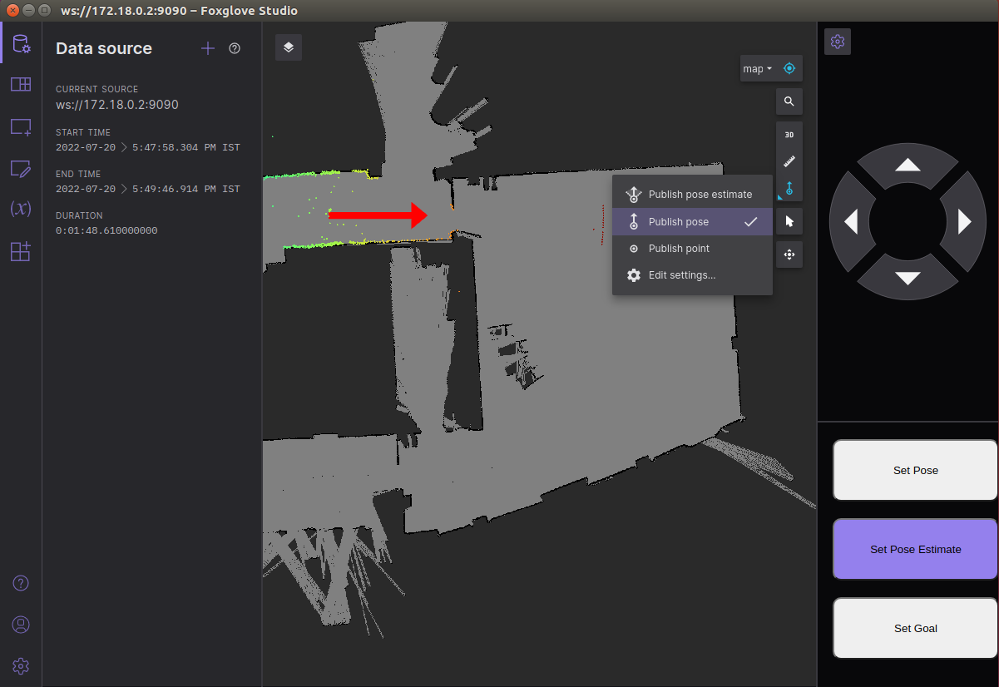
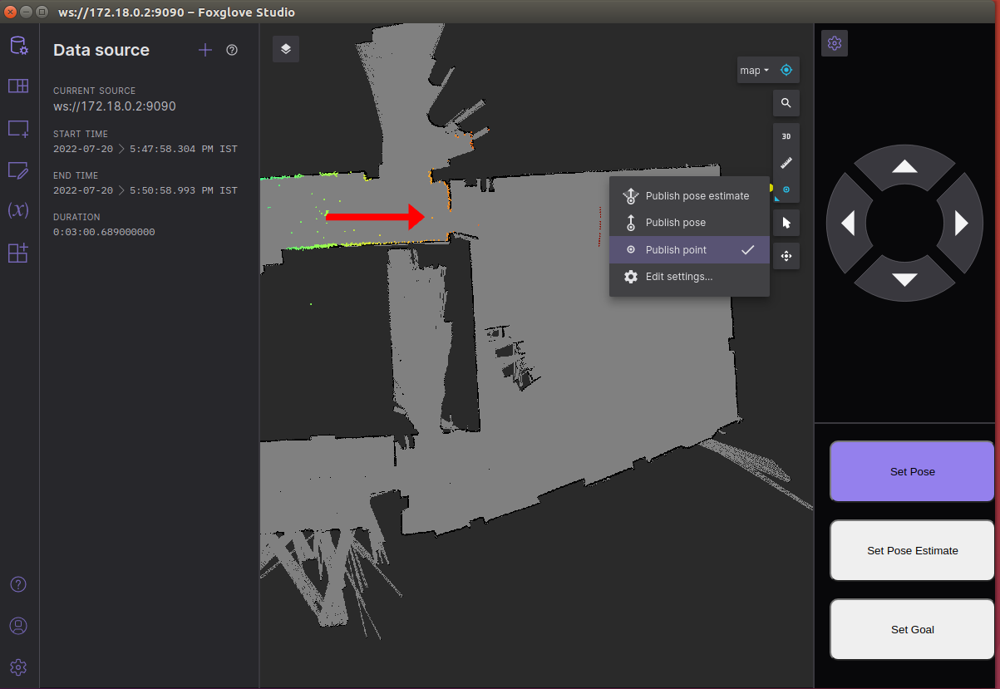
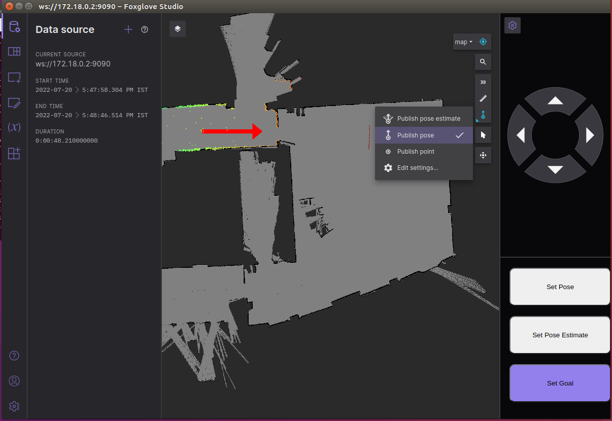

# [](#header-1)Autonomous Navigation
Initialize and operate MuSHRs out-of-the-box autonomous navigation stack! By the end of the tutorial, the car should be able to autonomously navigate around known obstacles on a known map.

{: .warning }
> If you are operating in simulation and use the particle filter for localization, we do not recommend testing with the sandbox.yaml default map as the localization system struggles in an open environment (all positions look the same!).

## Navigation Stack Overview
1. **Receding Horizon Controller (RHC) Node**
This node is responsible for motion planning and generating controls(steering, speed) for the car.
2. **Localization Node**
This node is implemented using a method called Particle Filtering which relies primarily on a data stream from the laser scanner.
3. **Planner Node**
This node generates a plan that the RHC controller will follow.

## Installing the Navigation Stack
{: .note }
The docker container may already have the required packages pre-installed. These instructions have been provided in case you need to reinstall the packages from scratch.

Download the packages for the RHC, Particle Filter and Global Planner:
```
# Go to your catkin workspace
$ cd ~/catkin_ws/src
# Clone the RHC node
$ git clone git@github.com:prl-mushr/mushr_rhc.git
# Clone the Particle Filter node
$ git clone git@github.com:prl-mushr/mushr_pf.git
# Install [SBPL](http://sbpl.net) for the global planner
$ sudo apt-get install ros-noetic-sbpl
# Install the Global Planner (this is for Jetson Xavier NX or sim use)
$ git clone git@github.com:prl-mushr/mushr_gp.git
# If you're using the jetson nano, use the mushr_gprm planner:
$ git clone git@github.com:prl-mushr/mushr_gprm.git
# Make
$ cd ~/catkin_ws && catkin_make
```
{: .note }
You also need to download all dependencies for the [mush_rhc](https://github.com/prl-mushr/mushr_rhc).

{: .note}
The reason why there are two planners (mushr_gp and mushr_gprm) is because mushr_gp is too resource intensive to be run on the jetson nano 4GB variant. However, if the desktop/laptop computer remains connected and in range of the MuSHR car, you can run mushr_gp on the computer instead as they share the same ROS master. If you need the planner to run on the jetson nano, we recommend using the mushr_gprm package. For the Jetson Xavier NX or when running on the sim exclusively, mushr_gp will work. Both repositories contain ROS packages that reproduce the desired functionality. You need only concern yourself with each package’s launch files to use them effectively. You can find the launch files in each package’s launch directory.

## Starting the navigation stack
### Starting the docker image
{: .note}
If you’re operating on the robot, you’ll need to SSH into it.

As we are running the entire system from docker, the first thing to do is to start the docker image. To do this, execute:
Turn on the car and vesc by plugging their batteries in. Enter the docker container.
```$ mushr_noetic```
or
```$ docker exec -it [CONTAINER_ID] bash```
if you don't want to start a new container.

{: .note}
If you will use tmux, once you’ve ssh’d into your robot and started the docker image, activate tmux: ```$ tmux```

{: .note}
Note: If the map you are using is very large map (>100x100 meters)–size inclusive of the unknown region–then the controller will be stuck sampling points. Save yourself the headache and shrink/crop your map before you begin.

### Starting the system
#### On the MuSHR robot
Launch teleop.launch. All these basic features are handled by a single launch file called teleop.launch.
```$ roslaunch mushr_base teleop.launch```

launch the map_server:
```
# Make sure mushr/mushr_base/mushr_base/mushr_base/maps has your map 
# and mushr_base/launch/includes/map_server.launch is set to your map
$ roslaunch mushr_base map_server.launch
```
launch the localization node:
```$ roslaunch mushr_pf real.launch```

Wait for the node to initialize:
```
$ Vesc callback called for first time....
$ Initialization complete
```

activate the RHC node:
```$ roslaunch mushr_rhc real.launch```

Wait for the code to initialize:
```
MPC
Control Node Initialized
```

Finally, launch the global planner node (use the planner appropriate for your system):
```$ roslaunch mushr_gp real.launch```
or
```$ roslaunch mushr_gprm real.launch```

Wait for it to initialize:
```
[ INFO] [1658309032.479218601]: Planner ROS node constructed. Need to initialize state
[ INFO] [1658309032.644907822]: Resizing the map
[ INFO] [1658309033.229219658]: Environment initialized
[ INFO] [1658309033.261994212]: Updated costmap
```

#### In simulation
When running in simulation, the steps are more or less the same as those for the real car, with the difference being that

1. We use the mushr_sim package to start the teleop.launch
2. Absence of the particle filter (not necessary in simulation)
3. Differences in the names of the launch files (instead of real.launch we use sim.launch)

Launch teleop.launch form mushr_sim:
```$ roslaunch mushr_sim teleop.launch```

activate the RHC node and Wait for the code to initialize.
```$ roslaunch mushr_rhc sim.launch```

Finally, launch the global planner node and Wait for it to initialize:
```$ roslaunch mushr_gp sim.launch```

### Running the navigation stack
To operate the navigation stack, we will use foxglove to send pose targets to the vehicle.

When operating in the real world, the pose estimate of the car may be incorrect. You can correct this by providing the particle filter with the correct pose estimate using the ```Set Pose Estimate``` button on the bottom right of the foxglove window and then using the button to publish clicked points.


In simulation, you may want to set the starting pose of the car at a certain point. To do this, click the ```Set Pose``` button on the bottom right of the foxglove window and use ```Publish point``` to publish a point or ```Publish Pose``` to publish a pose for the car:


To set a pose target, click on ```Set Goal``` button on the bottom right of the foxglove window and use ```Publish pose``` to publish a goal pose for the car:


The [following video](https://mushr.io/tutorials/autonomous-navigation/final_vid_stack.mp4) demonstrates the process of starting and running the stack in sim. In the real world, the difference would be the launch files being executed, and possibly the requirement to set the initial pose estimate.
