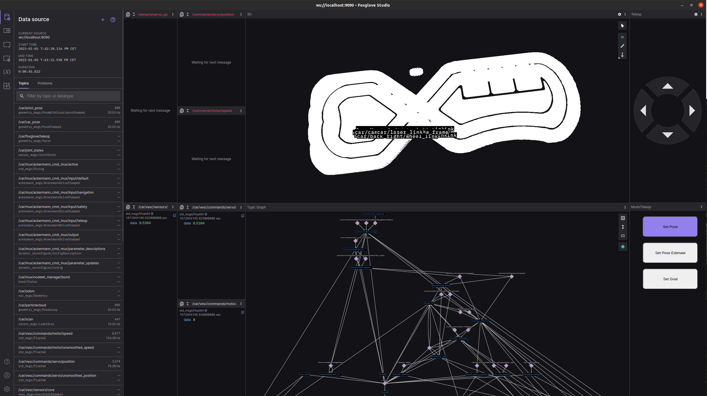

# Quickstart with Foxglove
Learn how to simulate the MuSHR Car with Foxglove visualizations.



{: .note }
This tutorial is for MacOS or Linux users only.

## Table of contents
{: .no_toc .text-delta }

1. TOC
{:toc}

---

## MuSHR Docker Container

### Installing Docker
First, install [Docker](https://docs.docker.com/get-docker/) and [Docker Compose](https://docs.docker.com/compose/install/) for your machine.

|                | Version |
|:---------------|:--------|
| Docker         | 20+     |
| Docker Compose | 1.29+   |

{: .warning }
> Check your [JetPack version](https://developer.nvidia.com/embedded/jetpack-archive), if it comes with Docker (e.g. version 4.6.1), do not reinstall the Docker, just install Docker-Compose.

{: .note }
If on Linux, follow the [post install](https://docs.docker.com/engine/install/linux-postinstall/) steps to make sure you can run Docker without root privileges.

### Installing MuSHR Docker Container
Clone the MuSHR repository at catkin_ws/src

```
$ mkdir -p catkin_ws/src
$ cd catkin_ws/src
$ git clone --branch noetic https://github.com/prl-mushr/mushr.git
```
### Run the installation script

```
$ ./mushr/mushr_utils/install/mushr_install.bash
```
It will prompt you with two questions.

- For running the MuSHR simulator, the answers should be no, no.
- For running the MuSHR racecar, the answers should be yes, no.

---

## Foxglove Studio

{: .note }
Make sure [foxglove](https://foxglove.dev/download) is the latest version.

---