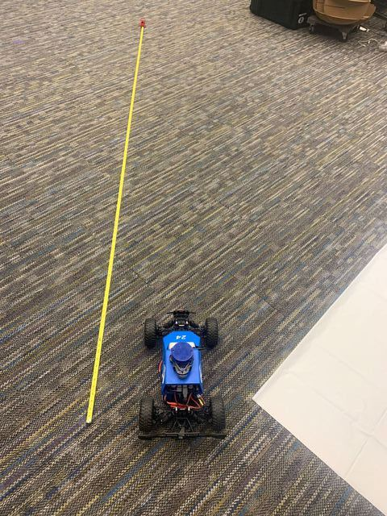

# Tuning Guide
The alignment of the hardware is critical for them to be able to work. With increased use, there will be some looseness or misalignment on the race car. Regular adjustments are very important, especially if you find that it doesn't work well no matter what. If incorrectly tuned, the commands applied by your autonomous controller may not correspond to what’s being executed on the physical hardware, making it difficult to debug issues with the controller.

**Requirements**
1. A computer that can ssh into your car.
2. A tape measure.
3. Find a relatively open space to run your car. We’ll be driving it straight for ~9ft (3m) and turning in a semi-circle of diameter ~6ft (2m).

The file will be located at:
``` ~/catkin_ws/src/mushr_base/vesc/vesc_main/config/racecar-uw-nano/vesc.yaml. ```

The file will look like this:

```yaml
# erpm (electrical rpm) = speed_to_erpm_gain * speed (meters / second) + speed_to_erpm_offset
#-4614
speed_to_erpm_gain: -2000
speed_to_erpm_offset: 0.0

[...omited for brevity]

# servo value (0 to 1) =  steering_angle_to_servo_gain * steering angle (radians) + steering_angle_to_servo_offset
steering_angle_to_servo_gain: 1.2135
steering_angle_to_servo_offset: 0.55
```

## Steering Angle Offset
This offset sets the default servo position when the car is driving straight. You will be changing the variable: ```steering_angle_to_servo_offset```.

**Tuning loop:**
While the car doesn’t drive straight, do the following procedure:
1. Start teleop:
```$ roslaunch mushr_base teleop.launch```
2. Drive car in a straight line a few times. It’s never going to be perfectly straight, so as long as it goes straight most of the time, it’ll be fine.
3. Adjust steering_angle_offset in vesc.yaml. Increase the offset if the car veers too much left, decrease if it veers too much right.
4. Stop teleop (Ctrl-C in the window you started teleop.launch in) and go back to Step 1.

{: .note }
Usually this value is between 0.4 and 0.6

## Speed to ERPM Gain
This gain converts velocity to ERPM. You will be changing the variable: ```speed_to_erpm_gain```.

{: .note }
The conversion from velocity to ERPM and steering angle to servo position is a linear function of the input command:
output = f(command) = gain * command + bias

**Before tuning:**Extend your tape measure to around 9-10 ft on the floor.


**Tuning loop:**
1. Place car at the base of the tape measure with the back wheelbase (indicated with a white line) lined up with 0.
~[](../assets/images/base_with_line.jpg)
2. Start teleop.
```$ roslaunch mushr_base teleop.launch```
3. Open another terminal on the car and run the command:
```$ rostopic echo /car/vesc/odom/pose/pose/position/x```
This will echo all the odometry information – how far the car has driven (in meters) in the x direction since teleop started. The value should be 0.0 at the start, as the car hasn’t moved yet.
4. Drive the car forward about 7-8 ft. The car will drive slightly further as it decelerates and stops. Make sure you only drive forward, not altering the servo position, otherwise you’ll have both x and y directional changes.
5. Record the distance traveled and convert to meters.
6. Compare to output of the rostopic echo command’s x value. If the reported distance traveled is larger than the actual, decrease the gain. If the reported distance is smaller, increase the gain. At the begining increasing or decreasing by 500 should allow you to quickly hone in on the value.
7. Stop teleop. Go back to step 1 if the values are not sufficiently close (within 2-3 cm).

{: .note }
This value can vary, but it should be on the order of thousands (2000-5000)

## Steering Angle Gain
This gain takes a steering angle in radians and converts it to a servo position. You will be changing the variable: ```steering_angle_to_servo_gain```.

In order to find the desired turn radius, we look to the [kinematic car model](https://github.com/prl-mushr/mushr/blob/master/mushr_description/kinematic_car_model.pdf). At low enough speeds (avoiding slipping and skidding) this model farily accurately represents the movement of the car. The turn radius is:
```R = L/2sin(beta)```,
where L is the length of the car (0.3 meters), and beta is ```arctan(1/2 * tan(delta))```, where delta is the steering angle. We will be setting the steering angle to the max (0.34 by default).

We will instead the length of a half cirlce, so 2 * R. Calculting this with the defaults, comes out to 1.722 meters (67.79 inches). If you tweak the max steering angle, or change the chassis, you will have to recompute this number.

There are two links can fate your caculating:
- [Angle Conversion Calculator](https://www.calculatorsoup.com/calculators/conversions/angle.php)
- [Equation Calculator](https://www.symbolab.com/solver/equation-calculator/%5Cfrac%7B0.44%7D%7B2%5Ccdot%20sin%5Cleft(arctan%5Cleft(%20%5Cfrac%7Btan%5Cleft(0.34%5Cright)%7D%7B2%7D%5Cright)%5Cright)%7D%5Ccdot2?or=input)


**Before tuning:**
Extend your tape measure to around 7-8 ft on the floor.

**Tuning loop:**
1. Place car at the base of the tape measure with the back wheelbase (indicated with a white line) lined up with 0.
.jpg)
2. Start teleop.
```$ roslaunch mushr_base teleop.launch```
3. Command the steering wheel max in whichever direction the measurement tape is. (Left and right are to be done separately)
4. Run the car such that the car has run over the tape and the back wheel is on the tape (see image).
~[](../assets/images/end.jpg)
5. Record the distance. The goal distance is 1.722 meters (67.79 inches). If it overshot, increase the gain, if it undershot, decrease the gain.

{: .note }
This value should be around 1.1-1.3

